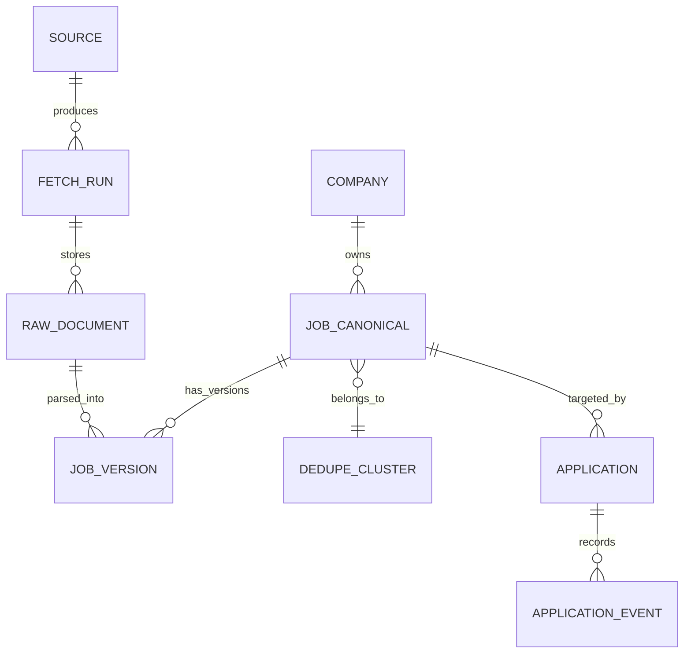

# Personal Job Search Engine and Job Funnel Repo

## Executive summary

The fastest path is **not** to build a general-purpose web scraper first. Build a **source-first ingestion layer** around the places where job data is already structured and semi-stable: Greenhouse Job Board, Lever Postings, Ashby Job Postings, SmartRecruiters company postings, Remote OK JSON, and We Work Remotely RSS. Those surfaces are either explicitly public or intentionally exposed for custom careers pages, while LinkedIn and Indeed reserve their official posting/apply APIs for approved partners, and Workable’s official API is account-scoped rather than a public job-search feed. That means your M0 should lean on official ATS/job-board endpoints, then only use browser rendering for the long tail. citeturn29view0turn28view0turn23view2turn34view0turn25view1turn23view7turn23view5turn23view6turn23view3

A pragmatic architecture is: **company/source seeds → discovery → adapter fetchers → raw evidence store → normalisation → dedupe/merge → scoring → triage/apply tracker**. For a personal repo, the best trade-off is usually **Python for ingestion and adapters**, **Postgres as source of truth**, **object storage for raw HTML/JSON snapshots**, and either **Postgres FTS/pg_trgm** or a small search engine only if search quality becomes a bottleneck. Schedule with **GitHub Actions** or cron at first; reserve distributed queues and browser fleets for later. citeturn17search0turn17search2turn17search3turn18search0turn14search2turn15search9

If you want a hard recommendation: **implement Greenhouse + Lever + Ashby + Remote OK + WWR first, plus sitemap/JSON-LD discovery for company sites**. That gets you high-signal coverage with relatively little scraping pain and avoids spending early weeks fighting anti-bot systems on platforms whose official APIs are restricted. This is an inference from the published source surfaces and access models below. citeturn29view0turn28view0turn23view2turn25view1turn23view7turn23view5turn23view6

## What not to reinvent

Two categories already exist and are worth reusing: **foundational crawling/extraction tools** and **job-specific starter repos**. The first category saves you months of infrastructure work. The second gives you adapter ideas, schemas, and operational patterns you can lift directly. citeturn17search0turn17search2turn18search0turn19search0turn21search2turn20search0

### Open-source tools and starter repos

| Name | Licence | Language | Best use in your repo | Maturity | Pros | Cons | Evidence |
|---|---|---:|---|---|---|---|---|
| Scrapy | BSD-3-Clause | Python | High-volume HTTP crawling, retry/caching, structured spiders | High | Battle-tested; great for adapter-heavy pipelines | Less pleasant for JS-heavy sites | citeturn17search0 |
| Crawlee | Apache-2.0 | TS/JS, Python | Hybrid crawler with HTTP + browser automation | High | Strong for mixed workloads and proxy/browser control | More moving parts than pure HTTP fetchers | citeturn17search1turn17search5 |
| Playwright | Apache-2.0 | TS/JS, Python, others | Browser fallback for JS-shell careers pages | High | Reliable multi-browser automation | Expensive if you overuse it | citeturn17search2turn17search14 |
| feedparser | BSD-style feedparser licence | Python | RSS/Atom ingestion | Medium | Tiny, simple, perfect for feeds | Limited scope; RSS only | citeturn17search3 |
| Trafilatura | Apache-2.0 | Python | Main-content extraction and light crawling | Medium | Good for extracting readable text and respecting politeness | Not a job-specific parser | citeturn18search0turn18search7 |
| JobSpy | MIT | Python | Quick experiments on mainstream boards | Medium | One library, many boards | Depends on brittle board scraping; not ideal as core architecture | citeturn16search3turn16search12 |
| Ever Jobs | MIT | TypeScript | Reference architecture for multi-source aggregation | Early/Medium | Normalised REST/GraphQL/CLI and many source packages | Young project; broad surface area can be heavy | citeturn19search0 |
| jobhive | MIT | Python | ATS-centric dataset + scrapers | Early/Medium | Huge ATS coverage and direct-source philosophy | Young ecosystem; dataset assumptions may not match your schema | citeturn21search0 |
| Levergreen job-board-scraper | MIT | Python/dbt | Good example of source → raw → transform → publish | Medium | Practical pipeline, dbt model, GitHub Actions scheduling | Narrower ATS set | citeturn21search2 |
| job-seek | CC0-1.0 | Python | Lightweight personal dashboard starter | Early | Good “personal tool” orientation; custom adapters included | Repo itself notes scrapers are not maintained | citeturn20search0 |
| job-board-aggregator | MIT code, CC BY-NC data | Python/JS | Discovery ideas at large scale | Early | Interesting ATS company discovery via Common Crawl patterns | Data licence is non-commercial; project is young | citeturn21search1 |

### Commercial accelerators worth considering

If you want to save time rather than money, the most useful commercial layers are: **Merge** for unified ATS connectivity, **Apify/Bright Data/Zyte** for managed scraping and browser infrastructure, **TheirStack/JobsPikr** for job-market datasets, and **SerpApi** for Google Jobs rather than raw SERP scraping. Merge is strongest when you need authenticated ATS/customer integrations; Apify/Bright Data/Zyte are strongest when you need extraction at scale; TheirStack/JobsPikr are strongest when you want data rather than crawling infrastructure. citeturn22search15turn22search1turn22search14turn22search2turn22search20turn22search3turn22search4turn22search5turn22search19

## Source landscape and platform map

### The high-confidence ingestion rule

Treat sources in this order:

1. **Official public ATS/job-board endpoints and feeds**
2. **Official company-hosted career widgets and `JobPosting` JSON-LD**
3. **Company sitemaps and careers pages**
4. **Browser automation only when the page is a JS shell**
5. **Restricted/partner-only platforms only if you become an approved partner**

That ordering is what keeps the repo maintainable. It follows directly from which systems actually publish stable machine-readable surfaces and which ones fence access behind partner programmes. citeturn29view0turn28view0turn23view2turn34view0turn25view1turn23view7turn23view5turn23view6

### Major ATS and platform map

| Platform | Practical route | Official endpoint or feed | Auth | Rate limits | Notes | Evidence |
|---|---|---|---|---|---|---|
| Greenhouse | **Use directly** | `GET /v1/boards/{board_token}/jobs`, `GET /v1/boards/{board_token}/jobs/{job_id}` | None for GET; Basic Auth only for application POST | No GET figure on reviewed page | Public Job Board API is ideal for aggregation | citeturn29view0 |
| Lever | **Use directly** | `GET /v0/postings/{site}?mode=json`, `GET /v0/postings/{site}/{id}`, `?mode=xml` | None for public GET/XML; API key for apply POST | Apply POST limited to **2 req/s** | Excellent public postings surface | citeturn28view0turn6search3turn6search2 |
| Ashby | **Use directly** | `GET /posting-api/job-board/{JOB_BOARD_NAME}?includeCompensation=true` | None | No public figure reviewed; dedicated partner feed updates hourly | Strong public source; compensation support | citeturn23view2turn39search0 |
| SmartRecruiters | **Use with care** | Public customer posting URLs shown as `GET /v1/companies/{companyIdentifier}/postings`; partner/customer job board feed `GET /feed/publications` | Docs are inconsistent: auth page lists Posting API as no-auth; other pages show API-key flows; marketplace feed uses `X-SmartToken` | Customer API: **10 req/s**, **8 concurrent** | Good source, but document the auth ambiguity in your adapter docs | citeturn34view0turn23view4turn32view0turn33view0turn31view0 |
| Workable | **Mostly scrape public careers/widget; official API if account-owned** | Official API: `GET https://{subdomain}.workable.com/spi/v3/jobs`; public widget/careers pages are documented for employer sites | Token/API-key based official API; no public seeker feed documented in reviewed docs | No public figure reviewed | Good ATS to support later via public careers pages, not via universal public API | citeturn23view3turn38search0turn38search2 |
| Wellfound | **HTML only unless you partner** | Public jobs/company pages on web; employer help pages show ATS integrations | No public developer API/feed found in reviewed official pages | N/D | Useful for company discovery, not a first-choice machine source | citeturn9search11turn9search10turn9search2turn9search5turn9search13 |
| Remote OK | **Use directly** | Homepage advertises RSS/JSON; JSON feed link redirects to `/api` | None | No published figure reviewed | API response includes attribution/link-back terms | citeturn24view0turn25view1 |
| We Work Remotely | **Use directly** | `/remote-jobs.rss` and category-specific `.rss` feeds | None | No published figure reviewed | WWR explicitly allows use with attribution | citeturn23view7 |
| Remote.co | **HTML only** | Public job/company/detail pages; no official feed/API docs found in reviewed pages | None for pages | N/D | Later source, not first-wave | citeturn13search11turn13search12 |
| Indeed | **Only if you are a partner/distributor** | Job Sync GraphQL API; XML feed for direct employers | Partner access; not for direct employers on Job Sync | Published Job Sync limits include **150 req/s** for small 1-job requests plus per-minute/hour caps | Not a good M0 source for a personal repo | citeturn23view6turn12search0turn12search10 |
| LinkedIn | **Only if you are an approved partner** | `/v2/simpleJobPostings` or `/rest/simpleJobPostings`, Apply Connect stack | Approved partner + OAuth client credentials | No public numeric limit reviewed; batch max **100 jobs**, token lifespan **30 mins** | Official access is restricted; not a personal-repo M0 source | citeturn23view5turn41view0turn41view1 |
| GitHub Actions | **Use as scheduler, not source** | Scheduled workflows via `on.schedule` | GitHub repo auth as normal | GitHub-specific | Good orchestration for personal repo jobs | citeturn14search2turn14search5turn15search9 |

### Example request and response snippets

**Greenhouse list jobs**

```http
GET https://boards-api.greenhouse.io/v1/boards/{board_token}/jobs?content=true
```

Typical response shape:

```json
{
  "jobs": [
    {
      "id": 127817,
      "internal_job_id": 144381,
      "title": "Vault Designer",
      "updated_at": "2016-01-14T10:55:28-05:00",
      "location": { "name": "NYC" },
      "absolute_url": "https://boards.greenhouse.io/...",
      "content": "...",
      "departments": [{ "id": 13583, "name": "Engineering" }],
      "offices": [{ "id": 8304, "name": "New York City" }]
    }
  ]
}
```

Greenhouse also supports `GET /jobs/{job_id}?questions=true&pay_transparency=true`, which can expose application questions and pay ranges when configured. citeturn29view0

**Lever postings JSON**

```http
GET https://api.lever.co/v0/postings/{site}?mode=json
```

Typical response fields include:

```json
[
  {
    "id": "posting-id",
    "text": "Software Engineer",
    "categories": {
      "location": "Remote",
      "commitment": "Full-time",
      "team": "Engineering",
      "department": "Product Engineering"
    },
    "descriptionPlain": "...",
    "hostedUrl": "https://jobs.lever.co/...",
    "applyUrl": "https://jobs.lever.co/.../apply",
    "workplaceType": "remote",
    "salaryRange": { "currency": "USD", "interval": "year", "min": 150000, "max": 200000 }
  }
]
```

Lever also exposes XML via `?mode=xml`. citeturn28view0turn6search2

## Recommended architecture

### Recommended stack

For a **personal** job engine, I’d use:

- **Python** for ingestion/adapters and normalisation. The crawler/extraction ecosystem is simply stronger there: Scrapy, Playwright for Python, feedparser, Trafilatura, plus job-specific repos like JobSpy and jobhive for reference. citeturn17search0turn17search14turn17search3turn18search0turn16search3turn21search0
- **FastAPI** or a tiny internal API layer for search/triage.
- **Postgres** as the system of record.
- **Object storage** for raw responses and evidence snapshots.
- **Optional Redis** only if you outgrow cron-style scheduling.
- **GitHub Actions** for M0 scheduling and CI. citeturn14search2turn14search5turn15search9

My strong recommendation: **do not introduce Kafka, Kubernetes, Elastic, or distributed browser pools in M0**. A personal repo doesn’t need them yet.

### Pipeline

```mermaid
flowchart LR
    A[Seed sources\nATS slugs, RSS, company lists, sitemaps] --> B[Discovery\ncareer pages, widgets, JSON-LD]
    B --> C[Adapters\nHTTP fetchers, RSS parsers, browser fallback]
    C --> D[Raw evidence store\nHTML / JSON / headers / hash]
    D --> E[Normalise\ncanonical job schema]
    E --> F[Dedupe and clustering]
    F --> G[Scoring and ranking]
    G --> H[Search + triage UI/CLI]
    H --> I[Apply tracker]
    I --> J[Reminders and state transitions]
```



### Core entities



### Suggested data model

A practical schema is:

- `sources`: `source_id`, `type`, `base_url`, `adapter`, `auth_mode`, `robots_policy`, `enabled`
- `companies`: `company_id`, `name`, `website`, `careers_url`, `ats_type`, `ats_slug`, `discovered_from`
- `fetch_runs`: one row per adapter execution with latency, status, retry count, response hash
- `raw_documents`: raw body pointer, headers, status, checksum, fetched_at
- `job_versions`: every parsed version of a posting from a raw document
- `jobs`: canonical merged job record
- `dedupe_clusters`: cluster key, confidence, chosen primary record
- `applications`: your own funnel state
- `application_events`: timestamped state changes, notes, reminders
- `saved_searches` / `scoring_profiles`: user-specific ranking rules

Store **every raw fetch**. That “evidence log” becomes your debugging system when a site changes or a dedupe decision looks suspicious.

### Example normalised job schema

```json
{
  "job_uid": "greenhouse:anthropic:123456",
  "canonical_url": "https://boards.greenhouse.io/anthropic/jobs/123456",
  "source": {
    "platform": "greenhouse",
    "adapter": "greenhouse_board",
    "source_record_id": "123456",
    "fetched_at": "2026-05-29T08:10:00Z"
  },
  "company": {
    "name": "Anthropic",
    "website": "https://www.anthropic.com",
    "careers_url": "https://boards.greenhouse.io/anthropic"
  },
  "title": "Software Engineer, Product",
  "department": "Engineering",
  "team": "Product Engineering",
  "location_text": "London, UK",
  "country_code": "GB",
  "region": "England",
  "city": "London",
  "workplace_type": "remote",
  "employment_type": "full_time",
  "posted_at": "2026-05-27T14:03:00Z",
  "updated_at": "2026-05-28T09:01:00Z",
  "salary": {
    "currency": "GBP",
    "min": 120000,
    "max": 160000,
    "interval": "year",
    "summary": "£120k–£160k"
  },
  "description_html": "<p>...</p>",
  "description_text": "...",
  "apply_url": "https://boards.greenhouse.io/anthropic/jobs/123456",
  "content_hash": "sha256:...",
  "evidence": {
    "raw_document_id": "raw_01J1...",
    "response_hash": "sha256:...",
    "adapter_version": "2026.05.29"
  }
}
```

### Dedupe algorithm outline

Use a **layered** dedupe, not a single fuzzy-match pass.

```python
def dedupe_score(a, b):
    score = 0.0

    # Strong identifiers
    if a["canonical_url"] == b["canonical_url"]:
        return 1.0
    if a["source"]["platform"] == b["source"]["platform"] and \
       a["source"]["source_record_id"] == b["source"]["source_record_id"]:
        return 0.99

    # Blocking
    if normalise_company(a) != normalise_company(b):
        return 0.0

    # Weighted features
    score += 0.30 * title_similarity(a["title"], b["title"])
    score += 0.20 * location_similarity(a, b)
    score += 0.15 * employment_similarity(a, b)
    score += 0.15 * date_similarity(a["posted_at"], b["posted_at"])
    score += 0.10 * description_similarity(a["description_text"], b["description_text"])
    score += 0.10 * salary_similarity(a.get("salary"), b.get("salary"))

    return score

def merge_jobs(jobs):
    blocks = block_by([
        normalise_company(job),
        title_fingerprint(job["title"]),
        remote_or_city(job)
    ], jobs)

    pairs = candidate_pairs(blocks)
    uf = UnionFind()

    for a, b in pairs:
        s = dedupe_score(a, b)
        if s >= 0.92:
            uf.union(a["job_uid"], b["job_uid"])
        elif s >= 0.80:
            send_to_manual_review(a, b, s)

    return build_clusters(uf)
```

Rules that matter in practice:

- Exact URL or ATS record ID wins.
- Titles need normalisation: strip seniority noise, punctuation, and locale suffixes.
- Remote/hybrid/on-site must be normalised consistently.
- Keep **version history**, because “duplicates” are often re-posts or refreshed requisitions, not true duplicates.

### Scoring, triage, and apply state machine

A good personal ranking formula is:

`score = skill_match + company_preference + comp_signal + recency + remote_fit - duplicate_penalty - stale_penalty`

Keep it explainable in UI: “ranked highly because Ruby, remote Europe, salary disclosed, posted <72h”.

For the funnel, use a deliberately boring state machine:

`discovered → shortlisted → tailoring → applied → acknowledged → screening → interview → offer → accepted/rejected/withdrawn → archived`

Every transition should create an `application_event` row. That gives you reminders, follow-up dates, and history automatically.

### Monitoring, observability, and CI/CD

For M0, monitor these only:

- per-adapter success rate
- 403/429 rate
- median fetch latency
- number of new jobs discovered per run
- schema drift alarms
- dedupe review queue size

CI/CD should run three things on every change: adapter unit tests, contract tests against frozen sample payloads, and one scheduled end-to-end smoke run. GitHub Actions is enough for this in M0 and supports schedule triggers directly. citeturn14search2turn14search5

## Implementation plan and roadmap

### M0 definition

**M0 goal:** a repo that can ingest jobs daily from a handful of official/public sources, de-duplicate them, rank them, and let you track your own applications.

**M0 scope**
- Adapters: Greenhouse, Lever, Ashby, Remote OK, WWR RSS
- Discovery: sitemaps + `JobPosting` JSON-LD + manual company seed list
- Storage: Postgres + raw blob store
- Search: Postgres FTS + trigram
- UX: CLI first, tiny web dashboard second
- Scheduler: GitHub Actions or cron
- No logins, no LinkedIn/Indeed scraping, no auto-apply

### Milestones and estimated effort

| Milestone | Deliverable | Effort |
|---|---|---:|
| Foundation | Repo skeleton, config, DB schema, raw evidence store, adapter interface | 3–5 days |
| First-wave sources | Greenhouse, Lever, Ashby, Remote OK, WWR adapters | 5–7 days |
| Discovery | Sitemap parser, JSON-LD extractor, company seed loader | 3–4 days |
| Normalisation | Canonical schema, location/workplace/salary normalisers | 3–4 days |
| Dedupe + ranking | Blocking, fuzzy scoring, explanation fields, review queue | 4–6 days |
| UX | CLI triage, saved filters, apply state machine, notes/reminders | 4–6 days |
| Ops hardening | Metrics, retry/backoff, tests, scheduled jobs, docs | 3–4 days |

### A realistic 6–12 week roadmap

| Window | Focus | Outcome |
|---|---|---|
| Weeks 1–2 | Repo foundation + first official adapters | Running pipeline with raw evidence and normalised jobs |
| Weeks 3–4 | Discovery + dedupe + search | Useful personal search engine, duplicate reduction, ranked results |
| Weeks 5–6 | Triage/apply tracker + observability | End-to-end personal funnel tool |
| Weeks 7–8 | Add SmartRecruiters public/company support and Workable careers-page support | Wider ATS coverage |
| Weeks 9–10 | Browser fallback for JS-shell boards; adapter drift tests | Better long-tail reliability |
| Weeks 11–12 | Nice-to-haves: notifications, exports, richer UI, job-score experiments | “Daily driver” polish |

If you only build one polished thing early, make it the **evidence-backed triage inbox**: left side filters, centre job cards, right side raw evidence + “why this ranked”. That UX pays off immediately.

## Seed sources and prioritisation

### Implement these first

| Priority | Source suggestion | Why it belongs early | Route | Evidence |
|---|---|---|---|---|
| Highest | Greenhouse board jobs | Clean public JSON, broad adoption | Official API | citeturn29view0 |
| Highest | Lever postings JSON | Clean public JSON and XML | Official API | citeturn28view0turn6search2 |
| Highest | Ashby job board | Public JSON with compensation option | Official API | citeturn23view2 |
| Highest | Remote OK JSON | Simple aggregator feed | `/api` | citeturn25view1 |
| Highest | We Work Remotely RSS | Explicitly allowed with attribution | RSS | citeturn23view7 |
| High | Company sitemaps | Great discovery layer for career URLs | `sitemap.xml` / `sitemap_index.xml` | Common web pattern; use as discovery recommendation |
| High | `JobPosting` JSON-LD on company pages | Often easiest non-API extraction path | Structured data in HTML | Common web pattern; use as parsing recommendation |
| High | SmartRecruiters company postings | Potentially public and structured | `/v1/companies/{company}/postings` | citeturn34view0turn23view4 |
| High | Lever XML feed | Simple secondary surface | `?mode=xml` | citeturn6search2turn28view0 |
| Medium | Workable hosted careers pages/widgets | Large employer base; public pages exist | Widget/careers-page scraping | citeturn38search0turn38search2 |
| Medium | SmartRecruiters marketplace feed | Strong if you control a customer token | `/feed/publications` | citeturn32view0 |
| Medium | Wellfound company/startup pages | Good for company discovery | HTML only | citeturn9search11turn9search0 |
| Medium | Remote.co company/job pages | Long-tail remote source | HTML only | citeturn13search11turn13search12 |
| Medium | GitHub organisations and careers pages | Useful for company discovery and scheduling infra | HTML + GitHub Actions for orchestration | citeturn15search5turn14search2 |
| Medium | Crunchbase/company datasets | Seed company discovery, not jobs themselves | External company list | Use only for discovery; not a primary job source |
| Lower | Indeed partner Job Sync | Powerful but restricted | Partner GraphQL/XML | citeturn23view6turn12search0 |
| Lower | LinkedIn Apply Connect / Job Posting | Restricted partner integration | Approved-partner APIs | citeturn23view5turn41view1 |
| Lower | Ashby dedicated partner feed | Excellent if you become a partner | JSON/XML hourly feed | citeturn39search0 |

The clear “first five” are **Greenhouse, Lever, Ashby, Remote OK, WWR**, then **sitemaps + JSON-LD company discovery**.

## Legal, ethical, and operating guardrails

Start with **public, documented, attribution-friendly sources**. Greenhouse, Lever, Ashby, Remote OK, and WWR already give you better signal than going head-first into LinkedIn/Indeed scraping. Remote OK’s API response includes link-back requirements, and WWR explicitly says you can use the feed if you attribute links back to WWR. citeturn25view1turn23view7

For rate limiting, be conservative even when the public docs are vague. SmartRecruiters publishes customer API throttles of 10 requests per second and 8 concurrent requests; Lever publishes a strict apply POST limit of 2 requests per second; Indeed’s Job Sync docs publish rate-limit tiers and 429 handling guidance; Trafilatura’s documentation explicitly recommends respecting basic politeness rules in parallel downloads. Even if your adapter is purely public-read, those are the right operational habits: per-host concurrency caps, exponential backoff with jitter, and incremental syncs. citeturn34view0turn28view0turn12search0turn18search7

Avoid logins and avoid surfaces that are clearly meant for approved integration partners unless you actually become one. LinkedIn says access is restricted to approved developers and is currently steering new access requests to Apply Connect; Indeed says Job Sync is not for direct employers and points direct employers to XML feeds instead. That’s a strong signal not to make those platforms your M0 ingestion backbone. citeturn23view5turn41view1turn23view6

Privacy-wise, keep your repo focused on **job data and your own application metadata**, not other people’s candidate data. Store only what you need for your funnel, encrypt anything personal, and make deletion easy. For raw evidence, keep HTML/JSON snapshots and headers, but avoid retaining unnecessary form payloads or third-party applicant data.

## Open questions and limitations

A few things were incomplete or messy in the official material reviewed:

- **SmartRecruiters docs are internally inconsistent**: the authentication overview lists Posting API among no-auth APIs, while the Posting API page says it supports only API key auth. In practice, their public company posting URLs are still worth testing adapter-by-adapter. citeturn33view0turn31view0turn34view0
- For **Workable, Wellfound, and Remote.co**, I found official web/help surfaces but not a clean public seeker-facing developer feed comparable to Greenhouse/Lever/Ashby. That makes them better second-wave targets. citeturn23view3turn38search0turn9search11turn13search11
- **GitHub Jobs** was not present as a current first-party developer surface in the official GitHub docs reviewed, so I treated **GitHub Actions** as orchestration, not as a jobs source. citeturn14search2turn15search9

The practical conclusion still holds: **build around official ATS endpoints and public feeds first, keep browser scraping as a fallback, and treat partner-only APIs as optional future integrations rather than core dependencies.**